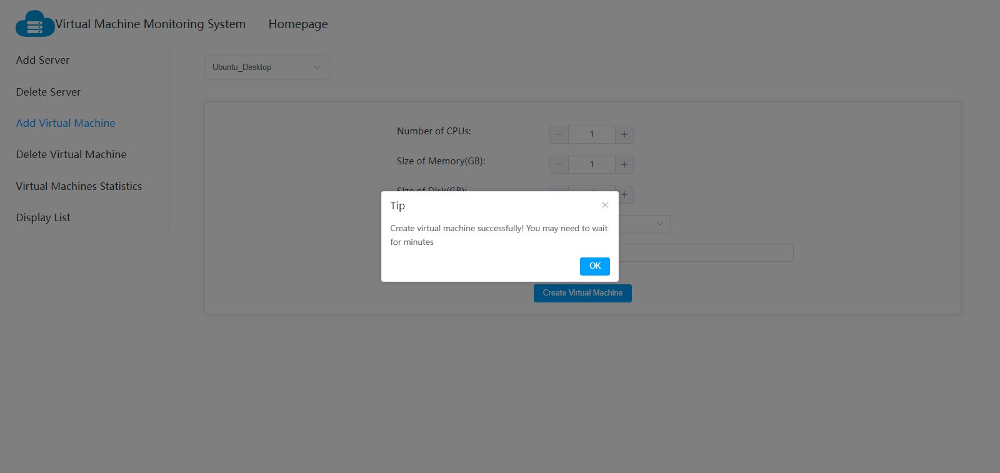

# VirtualMachineMonitoringSystemFrontend
使用Vue3搭建的虚拟机数据监控前端Web页面

#### 小组成员

| 小组成员 | 学号    |
| -------- | ------- |
| 李航宇   | 1913092 |
| 高鹏     | 1913073 |
| 马宁     | 1913780 |
| 郭书奇   | 1812985 |

#### 部署方式

>本项目已经构建成Docker镜像上传至Docker Hub，可以在安装了Docker服务的Linux机器上执行以下命令，启动前端服务(必要时可以登录Docker Hub查看lhy211/virtualmachinemonitoringsystemfrontend镜像的最新版本)

```shell
sudo docker pull lhy211/virtualmachinemonitoringsystemfrontend:782453cf1cebdc34cbc97e84af232a0ab29cea85
sudo docker run -d -p 80:80 \
lhy211/virtualmachinemonitoringsystemfrontend:782453cf1cebdc34cbc97e84af232a0ab29cea85
```

也可以手动构建Docker镜像运行

```shell
git clone git@github.com:SoftwareTestFinalHomework/VirtualMachineMonitoringSystemFrontend.git
cd VirtualMachineMonitoringSystemFrontend
sudo docker build . -t virtualmachinemonitoringsystemfrontend:v1.0
sudo docker run -d -p 80:80 virtualmachinemonitoringsystemfrontend:v1.0
```

#### 前端运行效果

##### 添加服务器界面


##### 服务器连接检查


##### 服务器添加


##### 虚拟机页面实时监控(每五秒获取数据一次)


##### 虚拟机历史数据展示(Influx DB中的间隔30分钟的所有数据)


##### 服务器与虚拟机的列表关系展示


##### 服务器删除


##### 虚拟机创建界面




##### 虚拟机删除界面


